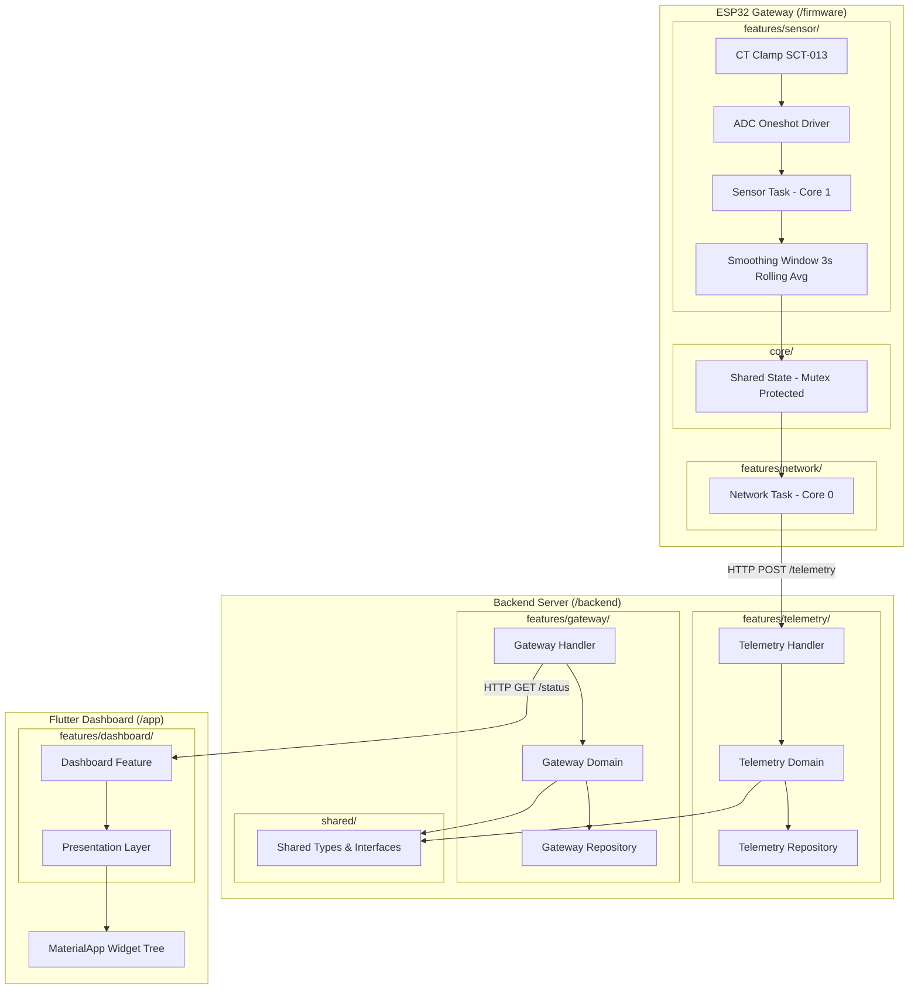
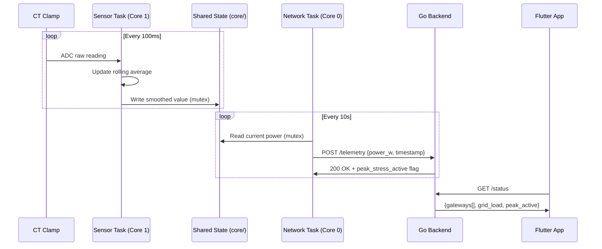

# Design Document: Nepal Grid Peak Load Controller

## Overview

The Nepal Grid Peak Load Controller is a three-tier demand-response system for household-level load management in Nepal's constrained electrical grid. The system architecture spans:

1. **Firmware (ESP32 Gateway)** — A bare-metal ESP-IDF v5.x application organized by feature modules: sensor sampling (CT clamp ADC logic) and network synchronization (backend communication), with shared core utilities for state management and concurrency primitives.
2. **Backend (Golang Server)** — A feature-first Go HTTP server where each feature (telemetry, gateway) is self-contained with its own domain types, handlers, and repository implementations. Shared contracts live in a common package.
3. **App (Flutter Dashboard)** — A feature-first Flutter application providing operator telemetry visualization and control.

### Design Decisions

- **Native ESP-IDF over Arduino/PlatformIO**: Provides direct access to FreeRTOS primitives, dual-core pinning, and ADC oneshot driver without abstraction overhead. Critical for deterministic real-time sampling.
- **Dual-core task separation**: Sensor sampling (Core 1) and network I/O (Core 0) are physically isolated to prevent network latency from disrupting ADC timing.
- **Feature-first architecture across all components**: Each feature directory is self-contained with its own domain logic, handlers/presentation, and data access. This reduces cross-feature coupling and allows features to evolve independently. Shared contracts and types live in a common/shared directory.
- **Feature-first Flutter**: Scales horizontally as new features (alerts, historical charts) are added without cross-feature coupling.
- **Riverpod 3 + code generation + flutter_hooks**: Provides compile-time safety via `@riverpod` annotations that generate type-safe providers, eliminates boilerplate with `riverpod_generator`, and enables functional widget composition through `HookConsumerWidget` from `hooks_riverpod`. This combination catches provider wiring errors at build time rather than runtime, reduces manual provider declarations, and allows hooks-based state logic (e.g., `useEffect`, `useState`) to coexist cleanly with Riverpod's reactive dependency graph.

## Architecture

### System Architecture Diagram



### Component Interaction Flow



### Directory Structure

```
/firmware
├── CMakeLists.txt
├── sdkconfig.defaults
└── main/
    ├── CMakeLists.txt
    ├── main.c                          # app_main() entry point
    ├── features/
    │   ├── sensor/
    │   │   ├── sensor_task.c           # Task_ReadSensors, ADC sampling loop
    │   │   ├── sensor_task.h           # Sensor task public API
    │   │   ├── smoothing.c             # Rolling average computation
    │   │   └── smoothing.h             # Smoothing window interface
    │   └── network/
    │       ├── network_task.c          # Task_NetworkSync, HTTP/WS communication
    │       └── network_task.h          # Network task public API
    └── core/
        ├── shared_state.c              # gateway_state_t initialization, mutex mgmt
        ├── shared_state.h              # Shared state structure and accessors
        └── config.h                    # Compile-time constants (intervals, pins)

/backend
├── go.mod
├── cmd/
│   └── api/
│       └── main.go                     # Composition root, wiring, signal handling
└── internal/
    ├── features/
    │   ├── telemetry/
    │   │   ├── domain.go               # TelemetryReading entity
    │   │   ├── handler.go              # POST /telemetry HTTP handler
    │   │   ├── repository.go           # TelemetryRepository interface
    │   │   └── memory_store.go         # In-memory implementation
    │   └── gateway/
    │       ├── domain.go               # GatewayStatus entity
    │       ├── handler.go              # GET /status HTTP handler
    │       ├── repository.go           # GatewayRepository interface
    │       └── memory_store.go         # In-memory implementation
    └── shared/
        ├── types.go                    # Shared domain types (IDs, timestamps)
        ├── interfaces.go               # Cross-feature contracts
        ├── middleware.go               # Logging, recovery, CORS middleware
        └── server.go                   # HTTP server setup, router composition

/app
├── pubspec.yaml
└── lib/
    ├── main.dart                       # Entry point (ProviderScope wraps MaterialApp)
    ├── core/
    │   └── constants.dart              # API base URL, polling intervals, colors
    └── features/
        └── dashboard/
            ├── data/
            │   └── dashboard_repository.dart
            ├── domain/
            │   └── models.dart
            ├── providers/
            │   ├── dashboard_providers.dart       # @riverpod annotated providers
            │   └── dashboard_providers.g.dart     # Generated provider code (build_runner)
            └── presentation/
                └── dashboard_screen.dart          # HookConsumerWidget
```

## Components and Interfaces

### Firmware Components

#### `app_main()` — Entry Point (`/firmware/main/main.c`)

- Calls `shared_state_init()` from `core/shared_state.h` to initialize the gateway state and mutex
- Creates Sensor Task pinned to Core 1 (priority 2, 4096B stack) via `features/sensor/sensor_task.h`
- Creates Network Task pinned to Core 0 (priority 1, 4096B stack) via `features/network/network_task.h`
- Does not return (FreeRTOS scheduler takes over)

#### `features/sensor/` — Sensor Feature Module

**`sensor_task.c` / `sensor_task.h`**:

- **Input**: ADC channel handle, oneshot unit handle, pointer to shared `gateway_state_t`
- **Output**: Updates shared smoothing window buffer via core state accessors
- **Behavior**: Reads ADC at 100ms intervals, delegates smoothing to `smoothing.c`
- **Concurrency**: Acquires mutex from shared state only for buffer writes

**`smoothing.c` / `smoothing.h`**:

- Pure computation module: maintains 3-second rolling average (30 samples)
- Skips failed reads (does not alter buffer on ADC failure)
- Exposes `smoothing_update(buffer, raw_value)` and `smoothing_get_average(buffer)` functions
- Testable in isolation on host machine (no hardware dependencies)

#### `features/network/` — Network Feature Module

**`network_task.c` / `network_task.h`**:

- **Input**: Pointer to shared `gateway_state_t` (read via mutex)
- **Output**: HTTP/WebSocket frames to backend
- **Behavior**: Polls backend every 10 seconds (from `core/config.h` `NETWORK_POLL_INTERVAL_MS`), transmits current smoothed power reading, receives peak-stress instructions
- **Concurrency**: Acquires mutex only for the duration of reading shared state

#### `core/` — Shared Core Module

**`shared_state.c` / `shared_state.h`**:

- Owns the `gateway_state_t` struct and its FreeRTOS mutex
- Provides accessor functions: `shared_state_write_sample()`, `shared_state_read_average()`
- Encapsulates mutex acquisition/release logic

**`config.h`**:

- Compile-time constants: `SAMPLE_INTERVAL_MS`, `SMOOTHING_SAMPLES`, `NETWORK_POLL_INTERVAL_MS`, ADC pin/channel definitions

### Backend Components

#### `/cmd/api/main.go` — Composition Root

- Configures `slog` structured logger
- Instantiates feature repositories (telemetry, gateway)
- Instantiates feature handlers, injecting their respective repositories
- Composes the HTTP router from shared middleware + feature handlers
- Registers OS signal handlers (`os.Interrupt`, `syscall.SIGTERM`)
- Initiates graceful shutdown with 15-second drain timeout

#### `/internal/features/telemetry/` — Telemetry Feature

**`domain.go`**:

- Defines `TelemetryReading` entity (gateway ID, power watts, timestamp)
- Contains no infrastructure imports

**`repository.go`**:

- Declares `TelemetryRepository` interface (persistence contract)
- Methods: `Store(ctx, TelemetryReading) error`, `GetLatest(ctx, gatewayID) ([]TelemetryReading, error)`

**`memory_store.go`**:

- Implements `TelemetryRepository` interface with in-memory storage
- Upgradeable to PostgreSQL without changing handler or domain code

**`handler.go`**:

- HTTP handler for `POST /telemetry`
- Request validation, deserialization, calls repository, returns response with `peak_stress_active` flag
- Depends only on types within this feature package and `/internal/shared/`

#### `/internal/features/gateway/` — Gateway Feature

**`domain.go`**:

- Defines `GatewayStatus` entity (ID, last seen, power watts, peak stress active)
- Contains no infrastructure imports

**`repository.go`**:

- Declares `GatewayRepository` interface
- Methods: `UpdateStatus(ctx, GatewayStatus) error`, `GetAll(ctx) ([]GatewayStatus, error)`

**`memory_store.go`**:

- Implements `GatewayRepository` interface with in-memory storage

**`handler.go`**:

- HTTP handler for `GET /status`
- Aggregates gateway statuses, computes total load, returns `StatusResponse`
- Depends only on types within this feature package and `/internal/shared/`

#### `/internal/shared/` — Shared Package

**`types.go`**:

- Shared value types used across features (e.g., `GatewayID`, timestamp helpers)

**`interfaces.go`**:

- Cross-feature contracts if needed (currently minimal — features are self-contained)

**`middleware.go`**:

- Logging middleware (wraps `slog`)
- Panic recovery middleware
- CORS middleware

**`server.go`**:

- HTTP server struct with configurable port (default 8080)
- Router composition: mounts feature handlers at their respective paths
- Graceful shutdown logic with context cancellation

### Flutter Dashboard Components

#### `/lib/main.dart` — Entry Point

- `WidgetsFlutterBinding.ensureInitialized()` first
- `runApp()` wraps root `MaterialApp` in a `ProviderScope` (Riverpod's dependency injection root)
- Theme with explicit `ColorScheme`

#### `/lib/core/constants.dart` — Shared Constants

- API base URL, polling intervals, color palette tokens

#### `/lib/features/dashboard/` — Dashboard Feature

**`domain/models.dart`**:

- `TelemetryReading`, `GatewayStatus`, `GridStatus` data classes

**`data/dashboard_repository.dart`**:

- HTTP client for backend communication
- JSON deserialization into domain models
- Exposed as a Riverpod provider via `@riverpod` annotation (see providers below)

**`providers/dashboard_providers.dart`** (annotated):

- Uses `@riverpod` annotation from `riverpod_annotation` package for all provider declarations
- Declares `dashboardRepository` provider exposing the `DashboardRepository` instance
- Declares `gridStatus` async provider that fetches current grid status via the repository
- Uses `Ref` for dependency injection between providers (e.g., repository access)
- Generated companion file `dashboard_providers.g.dart` produced by `build_runner` + `riverpod_generator`

**`presentation/dashboard_screen.dart`**:

- `DashboardScreen` extends `HookConsumerWidget` (from `hooks_riverpod`)
- Accesses providers via `ref.watch()` for reactive rebuilds
- Uses flutter_hooks (`useEffect`, `useState`) for local ephemeral state and lifecycle management
- Displays grid load status, connected gateways, peak stress indicator

#### Dependencies (pubspec.yaml)

**Runtime dependencies:**

- `flutter_riverpod` — Core Riverpod integration for Flutter
- `riverpod_annotation` — `@riverpod` and `@Riverpod()` annotations for code generation
- `hooks_riverpod` — `HookConsumerWidget` combining hooks + Riverpod
- `flutter_hooks` — React-style hooks for functional widget composition

**Dev dependencies:**

- `riverpod_generator` — Code generator that produces providers from `@riverpod` annotations
- `build_runner` — Dart build system for running code generators

### Interface Contracts

| Interface              | Location                                     | Methods                                                   |
| ---------------------- | -------------------------------------------- | --------------------------------------------------------- |
| `TelemetryRepository`  | `/internal/features/telemetry/repository.go` | `Store(ctx, TelemetryReading) error`                      |
|                        |                                              | `GetLatest(ctx, gatewayID) ([]TelemetryReading, error)`   |
| `GatewayRepository`    | `/internal/features/gateway/repository.go`   | `UpdateStatus(ctx, GatewayStatus) error`                  |
|                        |                                              | `GetAll(ctx) ([]GatewayStatus, error)`                    |
| `shared_state` (C API) | `/firmware/main/core/shared_state.h`         | `shared_state_init()`, `shared_state_write_sample(float)` |
|                        |                                              | `shared_state_read_average() -> float`                    |

## Data Models

### Firmware Data Structures

```c
/* /firmware/main/core/config.h */

/* ADC configuration constants */
#define ADC_UNIT          ADC_UNIT_1
#define ADC_CHANNEL       ADC_CHANNEL_6      /* GPIO34 */
#define ADC_ATTEN         ADC_ATTEN_DB_11
#define ADC_BITWIDTH      ADC_BITWIDTH_12

/* Sampling configuration */
#define SAMPLE_INTERVAL_MS        100
#define SMOOTHING_SAMPLES         30   /* 3000ms / 100ms = 30 samples */
#define NETWORK_POLL_INTERVAL_MS  10000
```

```c
/* /firmware/main/core/shared_state.h */

typedef struct {
    float smoothing_buffer[SMOOTHING_SAMPLES];
    uint8_t buffer_index;
    float current_avg_watts;
    SemaphoreHandle_t mutex;
} gateway_state_t;

/* Initialize shared state and create mutex */
esp_err_t shared_state_init(gateway_state_t *state);

/* Thread-safe write: update buffer with new sample, recompute average */
esp_err_t shared_state_write_sample(gateway_state_t *state, float sample);

/* Thread-safe read: get current smoothed average */
float shared_state_read_average(gateway_state_t *state);
```

```c
/* /firmware/main/features/sensor/smoothing.h */

/* Pure computation: update rolling buffer, return new average */
float smoothing_update(float *buffer, uint8_t *index, uint8_t capacity, float new_sample);

/* Pure computation: compute average of buffer contents */
float smoothing_get_average(const float *buffer, uint8_t capacity, uint8_t count);
```

### Backend Domain Entities

```go
// /internal/features/telemetry/domain.go
package telemetry

import "time"

// TelemetryReading represents a single power measurement from a gateway.
type TelemetryReading struct {
    GatewayID  string    `json:"gateway_id"`
    PowerWatts float64   `json:"power_watts"`
    Timestamp  time.Time `json:"timestamp"`
}
```

```go
// /internal/features/gateway/domain.go
package gateway

import "time"

// GatewayStatus represents the current operational state of a gateway.
type GatewayStatus struct {
    GatewayID        string    `json:"gateway_id"`
    LastSeen         time.Time `json:"last_seen"`
    LastPowerWatts   float64   `json:"last_power_watts"`
    PeakStressActive bool      `json:"peak_stress_active"`
}
```

```go
// /internal/shared/types.go
package shared

// GatewayID is a typed string for gateway identification.
type GatewayID = string
```

### API Request/Response Models

```go
// /internal/features/telemetry/handler.go (request/response types)
package telemetry

// TelemetryRequest is the payload sent by the gateway.
type TelemetryRequest struct {
    GatewayID  string  `json:"gateway_id"`
    PowerWatts float64 `json:"power_watts"`
}

// TelemetryResponse is returned to the gateway after telemetry ingestion.
type TelemetryResponse struct {
    Acknowledged     bool `json:"acknowledged"`
    PeakStressActive bool `json:"peak_stress_active"`
}
```

```go
// /internal/features/gateway/handler.go (response types)
package gateway

// StatusResponse is returned to the dashboard for grid overview.
type StatusResponse struct {
    Gateways       []GatewayStatus `json:"gateways"`
    TotalLoadWatts float64         `json:"total_load_watts"`
    PeakActive     bool            `json:"peak_active"`
}
```

### Flutter Data Models

```dart
/// /lib/features/dashboard/domain/models.dart

/// Represents a telemetry reading from a single gateway.
class TelemetryReading {
  final String gatewayId;
  final double powerWatts;
  final DateTime timestamp;

  const TelemetryReading({
    required this.gatewayId,
    required this.powerWatts,
    required this.timestamp,
  });

  factory TelemetryReading.fromJson(Map<String, dynamic> json) {
    return TelemetryReading(
      gatewayId: json['gateway_id'] as String,
      powerWatts: (json['power_watts'] as num).toDouble(),
      timestamp: DateTime.parse(json['timestamp'] as String),
    );
  }
}

/// Represents the operational state of a single gateway.
class GatewayStatus {
  final String gatewayId;
  final DateTime lastSeen;
  final double lastPowerWatts;
  final bool peakStressActive;

  const GatewayStatus({
    required this.gatewayId,
    required this.lastSeen,
    required this.lastPowerWatts,
    required this.peakStressActive,
  });

  factory GatewayStatus.fromJson(Map<String, dynamic> json) {
    return GatewayStatus(
      gatewayId: json['gateway_id'] as String,
      lastSeen: DateTime.parse(json['last_seen'] as String),
      lastPowerWatts: (json['last_power_watts'] as num).toDouble(),
      peakStressActive: json['peak_stress_active'] as bool,
    );
  }
}

/// Represents the overall grid status returned by the backend.
class GridStatus {
  final List<GatewayStatus> gateways;
  final double totalLoadWatts;
  final bool peakActive;

  const GridStatus({
    required this.gateways,
    required this.totalLoadWatts,
    required this.peakActive,
  });

  factory GridStatus.fromJson(Map<String, dynamic> json) {
    return GridStatus(
      gateways: (json['gateways'] as List)
          .map((g) => GatewayStatus.fromJson(g as Map<String, dynamic>))
          .toList(),
      totalLoadWatts: (json['total_load_watts'] as num).toDouble(),
      peakActive: json['peak_active'] as bool,
    );
  }
}
```

### Flutter Riverpod Provider Definitions

```dart
/// /lib/features/dashboard/providers/dashboard_providers.dart

import 'package:riverpod_annotation/riverpod_annotation.dart';
import '../data/dashboard_repository.dart';
import '../domain/models.dart';

part 'dashboard_providers.g.dart';

/// Provides the DashboardRepository instance for dependency injection.
/// Generated provider is accessed as `dashboardRepositoryProvider`.
@riverpod
DashboardRepository dashboardRepository(Ref ref) {
  return DashboardRepository();
}

/// Fetches the current grid status from the backend.
/// Automatically disposes when no longer watched.
/// Generated provider is accessed as `gridStatusProvider`.
@riverpod
Future<GridStatus> gridStatus(Ref ref) async {
  final repository = ref.watch(dashboardRepositoryProvider);
  return repository.fetchGridStatus();
}
```

## Correctness Properties

_A property is a characteristic or behavior that should hold true across all valid executions of a system — essentially, a formal statement about what the system should do. Properties serve as the bridge between human-readable specifications and machine-verifiable correctness guarantees._

### Property 1: Smoothing Window Correctness

_For any_ sequence of ADC read results (where each result is either a successful reading with a value or a failure), the smoothing window's `current_avg_watts` SHALL equal the arithmetic mean of the last `min(successful_count, 30)` successful readings, and failed reads SHALL NOT alter the buffer contents or average.

**Validates: Requirements 2.3, 2.5, 2.6**

### Property 2: Graceful Shutdown Drains Active Connections

_For any_ set of active HTTP connections with response times less than 15 seconds, when a termination signal is received, the Backend_Server SHALL allow all connections to complete before exiting, and the total shutdown duration SHALL not exceed 15 seconds.

**Validates: Requirements 4.4, 4.5**

### Property 3: Feature Package Dependency Isolation

_For any_ Go source file within `/internal/features/telemetry/`, its import statements SHALL NOT reference `/internal/features/gateway/` and vice versa. Each feature package may only import from `/internal/shared/` and the standard library — no cross-feature imports exist.

**Validates: Requirements 5.2, 5.3, 5.4, 5.5**

### Property 4: Source File Documentation Presence

_For any_ hand-authored source file in the project, it SHALL contain language-appropriate file-level documentation: `/** ... */` block comments for `.c`/`.h` files, `// Package ...` doc comments for Go package files, and `///` doc comments for `.dart` files.

**Validates: Requirements 7.1, 7.2, 7.3**

### Property 5: No Placeholder Comments in Production Code

_For any_ hand-authored source file in the project, it SHALL contain no comment patterns matching "TODO", "FIXME", "add logic here", "implement", or "placeholder" where the comment substitutes for actual implementation code.

**Validates: Requirements 7.6**

## Error Handling

### Firmware Error Handling

| Error Condition                          | Handling Strategy                                                            | Recovery                                                     |
| ---------------------------------------- | ---------------------------------------------------------------------------- | ------------------------------------------------------------ |
| ADC read failure (`esp_err_t != ESP_OK`) | Skip sample in `features/sensor/sensor_task.c`, do not call smoothing_update | Continue next 100ms cycle                                    |
| Mutex acquisition timeout                | `core/shared_state.c` returns error code, caller skips operation             | Non-blocking with `xSemaphoreTake(mutex, pdMS_TO_TICKS(50))` |
| Network communication failure            | `features/network/network_task.c` logs via `ESP_LOGW`, continues loop        | Retry on next 10s interval                                   |
| Stack overflow (task watchdog)           | Configured via `sdkconfig.defaults` with task WDT                            | System reset (hardware safety)                               |

### Backend Error Handling

| Error Condition                 | Handling Strategy                                                     | Recovery                            |
| ------------------------------- | --------------------------------------------------------------------- | ----------------------------------- |
| Invalid telemetry payload       | `features/telemetry/handler.go` returns HTTP 400 with structured JSON | Log warning, continue serving       |
| Repository write failure        | Handler returns HTTP 500, logs error with `slog.Error`                | Caller retries on next poll         |
| Graceful shutdown timeout (15s) | `shared/server.go` force-closes remaining connections                 | Exit with non-zero code             |
| Port already in use             | `cmd/api/main.go` logs fatal error, exits immediately                 | Operator restarts on different port |
| Panic in handler goroutine      | `shared/middleware.go` recovery middleware catches panic, returns 500 | Connection closed, server continues |

### Flutter Error Handling

| Error Condition              | Handling Strategy                          | Recovery                            |
| ---------------------------- | ------------------------------------------ | ----------------------------------- |
| Network timeout to backend   | Display "Connection Lost" indicator        | Auto-retry on next poll interval    |
| JSON deserialization failure | Log error, display stale data with warning | Retry on next successful response   |
| Widget build exception       | Flutter framework error boundary           | Display error widget, app continues |

## Testing Strategy

### Firmware Testing

- **Unit Tests (Host-based)**: Extract smoothing logic from `features/sensor/smoothing.c` into pure C functions testable on the host machine using Unity test framework (ESP-IDF's built-in test framework). Test rolling average calculation, buffer wraparound, and failed-read skipping.
- **Property Tests**: Use [theft](https://github.com/silentbicycle/theft) (C property-based testing library) to generate random ADC reading sequences and verify smoothing window invariants against `features/sensor/smoothing.c`. Minimum 100 iterations per property.
- **Integration Tests**: Flash to hardware, verify ADC readings are within expected range, verify task creation on correct cores using `xTaskGetAffinity()`.

### Backend Testing

- **Unit Tests**: Test feature domain logic in isolation using Go's `testing` package. Each feature (`features/telemetry/`, `features/gateway/`) has its own `_test.go` files co-located with the source. Test telemetry storage/retrieval, gateway status aggregation, request validation.
- **Property Tests**: Use [rapid](https://github.com/flyingmutant/rapid) (Go property-based testing library) for:
  - Feature package dependency isolation verification across all source files (Property 3)
  - Graceful shutdown with random connection counts and durations (Property 2)
  - Minimum 100 iterations per property test
- **Integration Tests**: Start server via `cmd/api/main.go`, send HTTP requests to feature endpoints, verify responses. Test signal handling with `os.Process.Signal()`.

### Flutter Testing

- **Unit Tests**: Test JSON deserialization in `features/dashboard/domain/models.dart` with known payloads. Test data model construction. Test generated providers using `ProviderContainer` with overrides to inject mock repositories and verify provider state transitions.
- **Property Tests**: Use [glados](https://pub.dev/packages/glados) (Dart property-based testing library) for documentation presence verification (Property 4, 5) via file system scanning.
- **Widget Tests**: Verify `ProviderScope` wraps `MaterialApp`, theme setup, and `features/dashboard/presentation/dashboard_screen.dart` rendering using `flutter_test`. Use `ProviderScope.overrides` to supply mock providers during widget tests.
- **Integration Tests**: End-to-end with mock backend server.

### Property Test Configuration

Each property-based test MUST:

- Run a minimum of 100 iterations
- Reference its design document property in a tag comment
- Tag format: **Feature: nepal-grid-peak-load-controller, Property {number}: {property_text}**

### Test Libraries by Component

| Component | Unit Test       | Property Test | Integration    |
| --------- | --------------- | ------------- | -------------- |
| Firmware  | Unity (ESP-IDF) | theft         | Hardware flash |
| Backend   | Go testing      | rapid         | HTTP client    |
| Flutter   | flutter_test    | glados        | flutter_driver |
