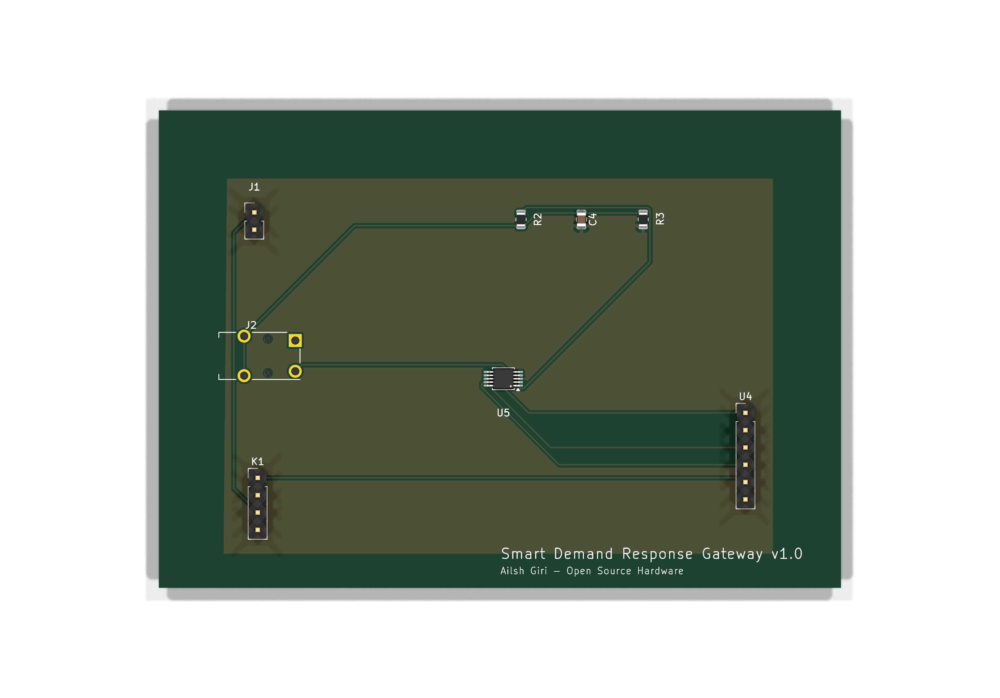

# Smart Demand Response Gateway

# Distributed Demand-Response Smart Gateway: Nepal-Grid Peak Load Controller

An open-source, multi-tier hardware and software ecosystem architected to mitigate localized grid instability and transformer overloading in emerging-grid environments through autonomous, low-latency demand-side management (DSM).

---

## 1. Executive Summary & Research Context

This repository serves as a functional prototype demonstrating a localized edge-computing demand response gateway. In emerging grid landscapes (e.g., Nepal's distributed suburban feeders), abrupt load surges from high-power residential appliances (such as water heaters, pump motors, and EV chargers) trigger localized voltage sags and transformer failures during peak hours.

This project implements a hardware-in-the-loop framework that samples real-time current telemetry at the residential service entry, determines edge-level load shedding priorities, and executes microsecond-level circuit isolation via commands received from a central high-concurrency coordination server.

---

## 2. System Architecture

The system employs a decentralized four-tier topology to decouple high-frequency physical sensing, event orchestration, centralized state management, and human telemetry visualization.

```
                    [ Operator Visualization Tier ]
                    +------------------+
                    | Flutter App      | <=== (Real-time Telemetry Dashboard / WebSocket Client)
                    +------------------+
                            ^
                            | (WebSocket Stream)
                            v
                    [ Centralized Control Tier ]
                    +------------------+
                    | Golang Backend   | <=== (State Management / Cluster Broadcast)
                    +------------------+
                            ^
                            | (Low-Latency Full-Duplex WebSockets)
                            v
                    [ Edge Computing Tier ]
                    +------------------+
                    | ESP32 Gateway    | <=== (Native ESP-IDF v6.x / FreeRTOS RTOS)
                    +------------------+
                           / \
                          /   \
                         v     v
          [SCT-013 CT Sensor]   [Opto-isolated Relay array]
          (ADS1115 16-bit ADC)  (230V AC Load Shedding Line)
          (I2C @ 0x48)
```

### Repository Structure

```text
├── /app              # Flutter-based network operator telemetry dashboard
├── /backend          # High-concurrency Golang control server (Clean Architecture)
├── /firmware         # Native ESP-IDF firmware for the ESP32 Gateway Module
├── /hardware         # KiCad schematics, PCB layout, BOM, and Gerber fabrication files
├── Makefile          # Root orchestrator — run `make help` for all targets
└── README.md         # Systems engineering specification (This file)
```

---

## 3. Firmware Configuration

The firmware uses a two-tier credential management system to keep secrets out of source control:

### Build-Time Configuration (Kconfig)

Set Wi-Fi credentials and backend connection details via ESP-IDF's menuconfig:

```bash
cd firmware
idf.py menuconfig
# Navigate to: Gateway Configuration → Wi-Fi Credentials
```

| Menu Path                                  | Key        | Description                  |
| ------------------------------------------ | ---------- | ---------------------------- |
| Gateway Configuration → Wi-Fi Credentials  | SSID       | Wi-Fi network name           |
| Gateway Configuration → Wi-Fi Credentials  | Password   | WPA2 password                |
| Gateway Configuration → Backend Connection | Host       | WebSocket server IP/hostname |
| Gateway Configuration → Backend Connection | Port       | WebSocket server port        |
| Gateway Configuration → Backend Connection | Gateway ID | Unique device identifier     |

The generated `sdkconfig` file is gitignored — only `sdkconfig.defaults` (with safe placeholders) is committed.

### Runtime Configuration (NVS)

For production deployments where the same binary is flashed to multiple gateways, credentials can be provisioned per-device into NVS (Non-Volatile Storage) without rebuilding:

```bash
# Generate an NVS partition image from a CSV
idf.py nvs-partition-gen generate nvs_data.csv nvs.bin 0x6000

# Flash the NVS partition
idf.py parttool write_partition --partition-name nvs --input nvs.bin
```

NVS keys:

| Namespace | Key        | Type   | Description                   |
| --------- | ---------- | ------ | ----------------------------- |
| `wifi`    | `ssid`     | string | Wi-Fi SSID (max 32 chars)     |
| `wifi`    | `password` | string | Wi-Fi password (max 63 chars) |
| `gateway` | `ws_host`  | string | WebSocket server host         |
| `gateway` | `ws_port`  | u16    | WebSocket server port         |
| `gateway` | `gw_id`    | string | Gateway device ID             |

**Priority:** NVS values take precedence over Kconfig defaults when present.

---

## 4. Development Workflow & AI Literacy

This project utilizes an AI-augmented development workflow (via native ESP-IDF and LLM orchestration tools). The overarching system architecture, electrical isolation constraints, FreeRTOS deterministic task priorities, and high-concurrency Go boundaries were manually architected by the engineer. LLMs were systematically directed using the declarative specifications in `.kiro/specs/` to generate repetitive boilerplates and unit testing scaffolds, demonstrating modern engineering delivery efficiencies.

---

## 5. Electrical / Schematic Diagram

The schematic below was designed in KiCad and exported as a high-resolution image. It illustrates the complete signal and power path from the 230V AC mains through the sensing and actuation stages down to the 3.3V ESP32 microcontroller logic.



### Key Safety & Isolation Features

| Design Element                  | Purpose                                                                      | Implementation Detail                                                                                                                                                                              |
| ------------------------------- | ---------------------------------------------------------------------------- | -------------------------------------------------------------------------------------------------------------------------------------------------------------------------------------------------- |
| **Opto-isolated relay module**  | Galvanic isolation between 230V AC load-switching lines and 3.3V MCU logic   | The relay coil is driven via an optocoupler (e.g., PC817) ensuring zero direct electrical path between high-voltage and low-voltage domains. Creepage distance on PCB exceeds 6mm per IEC 60950-1. |
| **SCT-013 current transformer** | Non-invasive AC current sensing without breaking the live conductor          | Magnetic coupling provides inherent isolation; burden resistor sized at 33Ω for 0–30A range mapped to 0–1V; signal digitized by ADS1115 16-bit ADC via I2C (GPIO22 SCL, GPIO21 SDA)                |
| **Dedicated power domains**     | Prevent ground loops and noise coupling between AC sensing and digital logic | Separate ground planes for AC-side (PE referenced) and DC-side (signal GND) joined at a single star-ground point                                                                                   |

### Schematic Hierarchy — Signal Flow & Isolation Boundary

```
┌ ─ ─ ─ ─ ─ ─ ─ ─ ─ ─ ─ ─ ─ ─ ─ ─ ─ ─ ─ ─ ─ ─ ─ ─ ─ ─ ─ ─ ─ ─ ─ ─ ─ ─ ─ ─ ─ ─ ─ ─ ┐
  HIGH-VOLTAGE AC POWER SIDE (230V / 50Hz)
│                                                                                           │

│  ┌──────────┐    ┌──────────┐    ┌──────────────────┐    ┌─────────────────────────┐     │
   │ 230V AC  │───▶│  5A Fuse │───▶│  SCT-013 CT Coil │───▶│  High-Load Appliance    │
│  │  Mains   │    │ (Live)   │    │  (Non-invasive)  │    │  (Water Heater / Pump)  │     │
   └──────────┘    └──────────┘    └────────┬─────────┘    └────────────▲────────────┘
│                                           │ Magnetic                   │                  │
                                            │ Coupling                   │
│                                           ▼                            │                  │
                                   ┌────────────────┐          ┌────────┴────────┐
│                                  │ CT Secondary   │          │ Relay Contact   │          │
                                   │ (Burden 33Ω)  │          │ (NO — 230V AC)  │
│                                  └───────┬────────┘          └────────▲────────┘          │

└ ─ ─ ─ ─ ─ ─ ─ ─ ─ ─ ─ ─ ─ ─ ─ ─ ─ ─ ─│─ ─ ─ ─ ─ ─ ─ ─ ─ ─ ─ ─ ─│─ ─ ─ ─ ─ ─ ─ ─ ┘
                                            │                            │
· · · · · · · · · · · · · · · · · · · · · ·│· · GALVANIC ISOLATION · · ·│· · · · · · · · · ·
                                            │  (Optocoupler + CT Air     │
                                            │   Gap — No Direct Path)    │
· · · · · · · · · · · · · · · · · · · · · ·│· · · · · · · · · · · · · ·│· · · · · · · · · ·
                                            │                            │
┌ ─ ─ ─ ─ ─ ─ ─ ─ ─ ─ ─ ─ ─ ─ ─ ─ ─ ─ ─ ─ ─ ─ ─ ─ ─ ─ ─ ─ ─ ─ ─ ─ ─ ─ ─ ─ ─ ─ ─ ─ ┐
  LOW-VOLTAGE DC LOGIC SIDE (3.3V)
│                                                                                           │

│          ┌────────────────┐    ┌──────────────────┐    ┌──────────────────────┐           │
           │ ADS1115 ADC    │◀───│ Analog Signal    │◀───│ CT Secondary Output  │
│          │ (I2C @ 0x48)   │    │ (0–1V AC)       │    │ (via Burden Resistor)│           │
           └───────┬────────┘    └──────────────────┘    └──────────────────────┘
│                  │                                                                        │
                   │ I2C (SDA/SCL)
│                  ▼                                                                        │
           ┌──────────────────────────────────────────────────────┐
│          │                    ESP32 MCU                          │                         │
           │                                                      │
│          │  • ADC Task: RMS current computation (25-cycle avg)  │                         │
           │  • WebSocket Client: ←→ Golang Backend               │
│          │  • Relay Control Task: GPIO → Optocoupler → Relay    │                         │
           │  • OTA / Debug via UART                              │
│          └───────────────────────────┬──────────────────────────┘                         │
                                       │
│                                      │ GPIO                                               │
                                       ▼
│                              ┌───────────────┐                                            │
                               │ Optocoupler   │──────▶ Relay Coil Driver (NPN)
│                              │ (PC817)       │       (Drives relay on AC side)             │
                               └───────────────┘
│                                                                                           │

└ ─ ─ ─ ─ ─ ─ ─ ─ ─ ─ ─ ─ ─ ─ ─ ─ ─ ─ ─ ─ ─ ─ ─ ─ ─ ─ ─ ─ ─ ─ ─ ─ ─ ─ ─ ─ ─ ─ ─ ─ ┘

DATA FLOW SUMMARY:
  AC Mains → SCT-013 (magnetic) → Burden Resistor → ADS1115 (I2C) → ESP32
  ESP32 → Optocoupler (galvanic) → Relay Module → Load Appliance (230V)
```

> **Note:** To generate the schematic image from source, open `hardware/design-files/*.kicad_sch` in KiCad 10.x and export via _File → Export → SVG/PNG_. Place the exported image at `hardware/documentation/pcb_top_render.png`.
